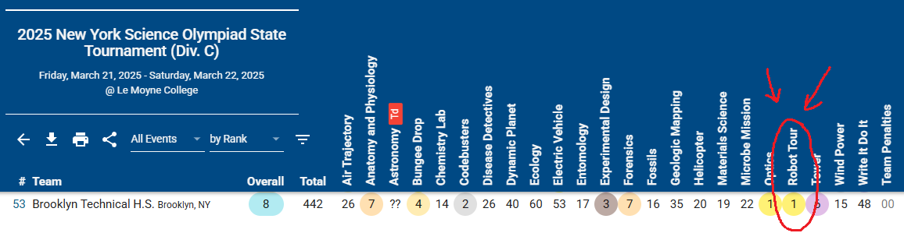

# Scioly Robot Tour 2025-2026
An autonomous robot developed for BTHS Science Olympiad during the **2025–2026** season.

The system combines odometry, distance-sensing, and careful calibration to navigate a competition course and interact with objects under strict time and dimensional constraints.
#

## Overview
<u>Robot Tour</u> requires an autonomous vehicle to navigate a predefined course, interact with objects, and complete a sequence of movements accurately within a specified amount of time.

I developed and iterated on the robot's mechanical and software systems throughout the 2024–2025 and 2025–2026 seasons. The 2025–2026 implementation significantly expanded on its original distance-measuring system by **adding a magnetic encoder that directly measured how far the wheels rotated**. Instead of brute-forcing distance based mainly on time, the robot could use the physical circumference of its wheels to calculate how far it had traveled.

- **MT6701 magnetic encoder** — measures wheel rotation for distance estimation
- **MPU6050 IMU** — provides yaw measurements for heading correction
- **Ultrasonic sensor** — measures distance to objects and course features
- **RGB LED** — provides real-time motion and calibration feedback

## Results

### 2025-2026
[**Science Olympiad at the University of Pennsylvania (SOUPS)**](https://www.duosmium.org/results/2026-02-14_penn_invitational_c/): 3rd Place 
[**Princeton University Science Olympiad**](https://www.duosmium.org/results/2026-02-07_princeton_invitational_c/): 5th Place 
[**New York City South Regional Tournament**](https://www.duosmium.org/results/2026-01-31_NY_nyc_south_regional_c/): 5th Place 
[**Rickards Science Olympiad Invitational**](https://www.duosmium.org/results/2025-11-01_rickards_invitational_c/): 9th Place 

### 2024-2025
[**New York Science Olympiad State Tournament**](https://www.duosmium.org/results/2025-03-21_NY_states_c/): 1st Place 
[**New York City South Regional Tournament**](https://www.duosmium.org/results/2025-02-01_NY_new_york_city_south_regional_c/): 1st Place 
[**Columbia University Science Olympiad**](https://www.duosmium.org/results/2025-01-25_columbia_university_invitational_c/): 2nd Place 
[**Boyceville Satellite Science Olympiad Invitational**](https://www.duosmium.org/results/2024-12-02_boyceville_satellite_invitational_c/): 3rd Place 
[**Rickards Science Olympiad Invitational**](https://www.duosmium.org/results/2024-11-02_rickards_invitational_c/): 5th Place 

## Motion Control
### Encoder-Based Movement
The **2024-2025** version mainly used carefully calibrated timing to control how long the motors ran to reach a certain distance. (which later caused issues with friction and voltage)

For **2025–2026**, I transitioned to an encoder-based measurement approach.

## Heading Control
The MPU6050 provides a continuous yaw feedback during movement to keep the robot straight (a basic proportional controller)

The controller compares the measured yaw against a target heading:

- **yaw error = target heading − measured heading**

If the robot begins to stray from its target heading, the motor speeds adjust asymmetrically to correct the trajectory. 

The same feedback loop is also used during turns. The robot progressively reduces its turning speed as it approaches a target heading, allowing it to settle within approximately a one-degree tolerance during calibration.

## Calibration
Because the robot is affected by real-world physical factors, I'm considering factors, such as robot dimensions, wheel diameter, motor characteristics, battery voltage, surface friction, alignment, and sensor offsets. So therefore I calibrated movement systems around the physical robot.

This repository includes a `Robot Tour Data Sheet` documenting measured movements and the corresponding movement commands that we commonly need for competitions.

The calibration data covers:
* Forward movement
* Distance-based approaches
* Distance-based corrections
* 90° turns
* 180° turns
* Positioning relative to course objects

The goal was not simply to make the robot complete one track, but to develop reusable movement primitives that could be calibrated and integrated into different tracks.

## Movement Glossary
| Function: | Purpose: |
| :---- | ----- |
| fw(d) | Move forward **d** centimeters |
| bw(d) | Move backward **d** centimeters |
| r() | Rotate 90° right |
| l() | Rotate 90° left |
| r180() | Rotate 180° right |
| l180() | Rotate 180° left |
| fu(d) | Move forward until **d** centimeters from an object |
| until(d) | Move backwards until **d** centimeters from an object |

## Example Track

The `Example Track/` directory contains a complete track that won us 3rd at the SOUPS (Science Olympiad at the University of Pennsylvania).

For example:

fu(21.5); 
l(); 
fw(50); 
fw(50); 
r(); 
fw(50); 
l(); 
fw(50); 
l180(); 
fw(50); 

The corresponding `directions.txt` file provides a human-readable representation of the route before it is inputted into the Arduino program. This separation makes it easier to design and revise routes.

## Development History
### 2024–2025

The original version relied heavily on empirically calibrated timing constants.

For example, forward and backward movement were determined using relationships between:

- movement distance
- motor speed
- elapsed time
- braking behavior

This approach was functional but sensitive to changes in battery voltage, motor behavior, and physical conditions.

### 2025–2026

The movement system was redesigned around measured wheel rotation.

Major improvements included:

- Added MT6701 magnetic encoder
- Replaced primary distance estimation with encoder-based odometry
- Added acceleration/deceleration profiles
- Improved heading correction
- Added dedicated 180° turning routines
- Refined ultrasonic distance-based positioning
- Reorganized movement into reusable high-level primitives
- Added documented physical calibration data

## Hardware

Constructed utilizing parts from a [ELEGOO Robot Car Kit](https://www.amazon.com/dp/B07KPZ8RSZ?lv=shuf&channelId=500&plpRedirect=mhFallback) (Arduino UNO, Kit Shield, MPU6050 IMU, Yellow DC gearbox motors), two custom CAD-designed baseplates and claw grips, dowel with a cadded ducky for good luck, ultrasonic sensors, 8-pack battery holder (w/ non-rechargeable alkaline batteries as per construction parameters), magnetic encoders (MT6701), and [DC Buck Converter](https://a.co/d/06xhJ2Bz),

Designed on Bambu Studio and printed on Bambu Lab A1 Mini

Constructed following the 2025-2026 SciOly build parameters: [Link](https://drive.google.com/file/d/1CcOrLIdCGCBEwNyRmbU7zTlQBbmRYcFV/view)

## Credits
The 2024–2025 implementation was based in part on a kit design and includes code credited to Jason Wei. (CWRU' 29)